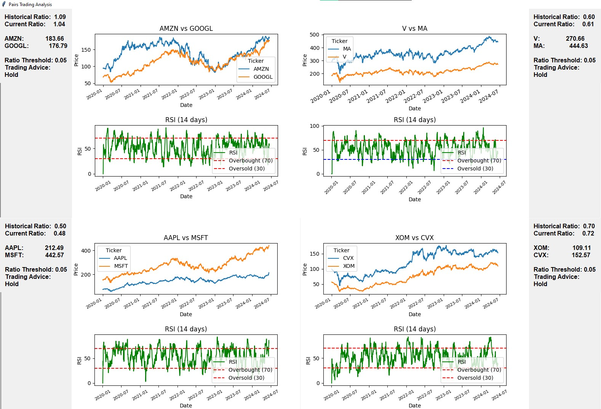

# Pairs Trading HUD
This application uses Python and tkinter to display pairs trading analysis for selected stock pairs using historical data fetched from Yahoo Finance (`yfinance`). It plots the price trends and Relative Strength Index (RSI) for each pair, along with providing trading advice based on current and historical ratios.

## Purpose

The purpose of this application is to visualize and analyze pairs trading opportunities between selected stocks. It helps traders identify potential trading signals based on historical price ratios and technical indicators like RSI.

## Components

### Python Script (`PairsTradingApp.py`)

The main script utilizes the following components:

- **tkinter**: Used for creating the graphical user interface (GUI).
- **matplotlib**: Used for plotting the price charts and RSI graphs.
- **pandas**: Used for data manipulation and analysis, particularly for handling historical stock data.
- **yfinance**: Used for fetching historical stock data from Yahoo Finance.
- **datetime**: Used for date calculations and handling.

### Features

- **Pairs Analyzed:**
  - AMZN vs GOOGL
  - V vs MA
  - AAPL vs MSFT
  - XOM vs CVX

- **Displayed Information:**
  - Price history and RSI over time.
  - Current and historical price ratios.
  - Trading advice based on the current ratio compared to historical data.

